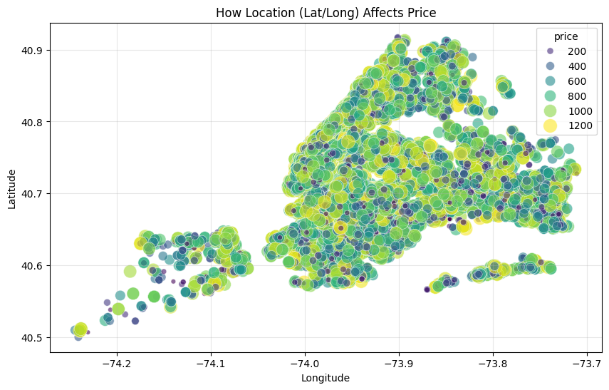
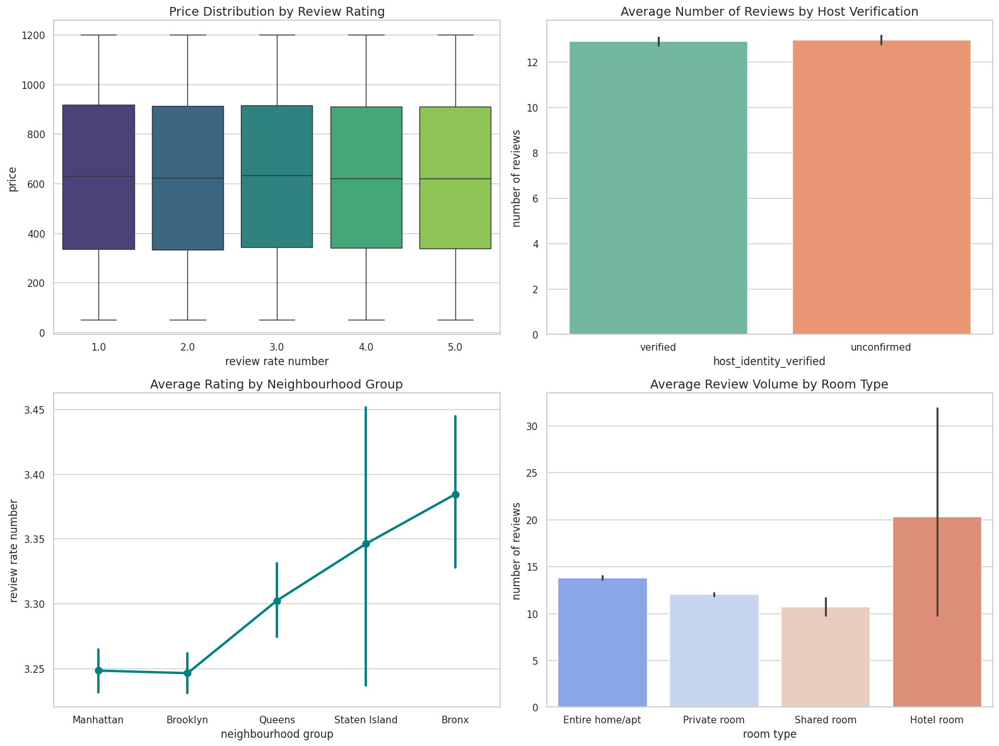

# New York City Airbnb Market Analysis & Strategic Report

This non-technical report synthesizes our exploratory data analysis and predictive modeling across New York City Airbnb listings. The goal is to help platform managers and hosts understand what factors drive listing prices, annual property availability, and guest satisfaction to support data-driven decision-making.

---

## Executive Summary
An analysis across primary categorical, spatial, numerical, and machine learning models reveals that traditional price drivers (such as room type, neighborhood group, or cancellation flexibility) exhibit minimal isolated impact on listing prices, which hover consistently between **$600 and $650**. However, annual availability and customer engagement vary significantly by borough demand, review volume, and stay restrictions.

---

## What Factors Drive Listing Prices?

Pricing across NYC listings remains surprisingly uniform. Standalone categorical attributes do not create massive price swings on their own.

* **Baseline Pricing:** Average nightly rates across almost all categories hover in a tight band around **$600 to $650**.
* **Host Verification & Policies:** Verified hosts do not command higher prices than unconfirmed hosts. Similarly, offering a flexible, moderate, or strict cancellation policy does not impact baseline pricing.
* **Room Types & Service Fees:** Entire homes, private rooms, shared rooms, and hotel rooms all average similar rates. Service fees scale proportionally with listing prices, ranging between **$119 and $129**.
* **Geographic Spread:** While location intuitively feels like a price driver, raw geographic coordinates show budget ($200) and luxury ($1,200) listings scattered closely together across all five boroughs.

---

## What Factors Influence Booking & Annual Availability?

Unlike pricing, annual availability (`availability_365`) varies significantly based on borough location, stay rules, and guest activity.

* **Borough Demand:** High-demand areas like **Manhattan** and **Brooklyn** have the lowest annual availability (**~105–110 open days per year**), indicating high occupancy. Outer boroughs like **Staten Island** (**~180 days**) and **The Bronx** (**~165 days**) stay open much longer.
* **Minimum Stay Rules:** Requiring long minimum stays (8–9 nights) reduces open availability down to **~87 days**, likely due to lower booking turnover.
* **Predictive Drivers:** Feature importance analysis from our **Random Forest Regressor** shows that exact micro-location (`long` at ~0.170, `lat` at ~0.158) and monthly review activity (`reviews per month` at ~0.130) are the strongest predictors of annual listing availability.

---

## What Drives Guest Reviews and Satisfaction?

Analyzing customer engagement metrics shows what influences review volume and rating scores across listings.

* **Price vs. Satisfaction:** Charging a higher nightly price does **not** result in higher customer review ratings. Rating scores remain flat across all price tiers.
* **Borough Rating Differences:** Listings in outer boroughs—specifically **The Bronx (~3.38)**, **Staten Island (~3.35)**, and **Queens (~3.30)**—achieve higher average guest ratings than central locations like **Manhattan and Brooklyn (~3.25)**.
* **Review Volume:** **Hotel rooms** generate the highest average number of reviews (**~20 reviews** per listing), outperforming standard entire homes (**~14**) and private rooms (**~12**).

---

## 4. Key Strategic Recommendations

| Target Audience | Actionable Strategy | Expected Business Outcome |
| :--- | :--- | :--- |
| **Hosts** | **Optimize Minimum Stay Restrictions:** Reduce strict minimum night requirements (e.g., lower from 8+ nights to 1–3 nights) to increase listing visibility and booking frequency. | Higher annual occupancy and increased booking turnover. |
| **Hosts** | **Focus on Service over Premium Pricing:** Maintain competitive pricing regardless of location, as higher rates do not improve guest review scores. | Better guest reviews and higher repeat booking potential. |
| **Platform Strategy** | **Targeted Borough Marketing:** Focus traveler promotional campaigns in Queens, Staten Island, and The Bronx where satisfaction ratings are high but availability remains underutilized. | Balanced demand across all NYC boroughs and improved platform utilization. |
| **Platform Strategy** | **Expand Boutique & Hotel Inventory:** Partner with boutique hotel managers to onboard more hotel-style room types. | Higher customer review engagement and overall review volume. |